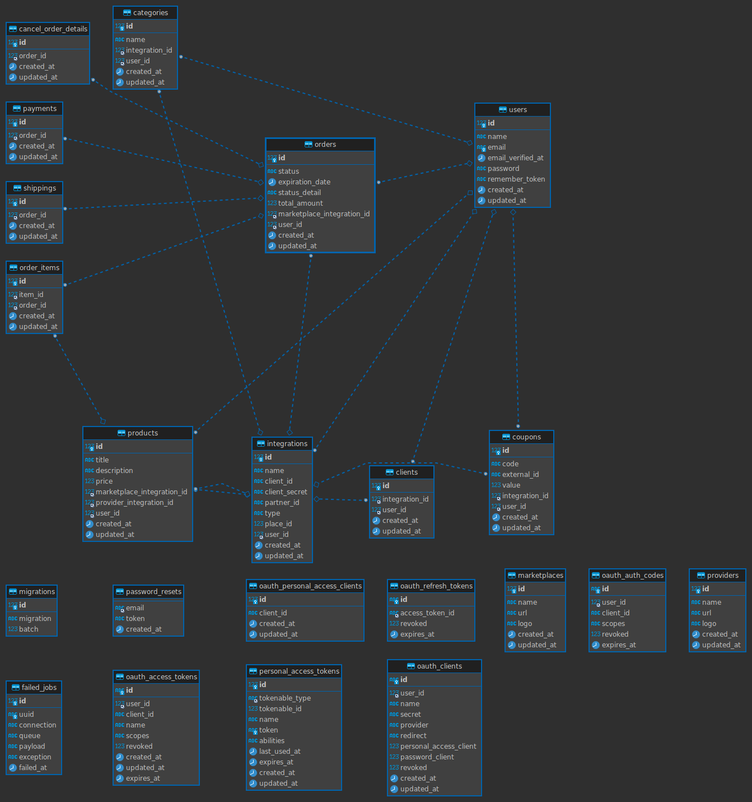

# DropShipper

> Projeto ainda em desenvolvimento, em fase de criação dos requisitos funcionais.
> O objetivo deste projeto é de facilitar a venda de produtos no modelo dropshipping.
> Este sistema deverá gerenciar os produtos vindo de fornecedores nas plataformas de ecommerce e marketplace.
> De forma que os vendedores dropshipping tenham menos trabalho ao enviarem os produtos para as plataformas e ainda sejam notificados quando forem vendidos.

## 🚀 Instalando DropShipper

Para instalar o DropShipper, siga estas etapas:

- No diretório backend:

  > composer install

  > php artisan migrate

  > php artisan passport:install

- No diretório frontend:

  > npm install

## ☕ Usando DropShipper

Para usar <DropShipper>, siga estas etapas:

- No diretório frontend

  > npm run dev

- No diretório backend
  > php artisan serve

## 📫 Contribuindo para DropShipper

Para contribuir com DropShipper, siga estas etapas:

1. Bifurque este repositório.
2. Crie um branch: `git checkout -b <nome_branch>`.
3. Faça suas alterações e confirme-as: `git commit -m '<mensagem_commit>'`
4. Envie para o branch original: `git push origin <nome_do_projeto> / <local>`
5. Crie a solicitação de pull.

Como alternativa, consulte a documentação do GitHub em [como criar uma solicitação pull](https://help.github.com/en/github/collaborating-with-issues-and-pull-requests/creating-a-pull-request).
